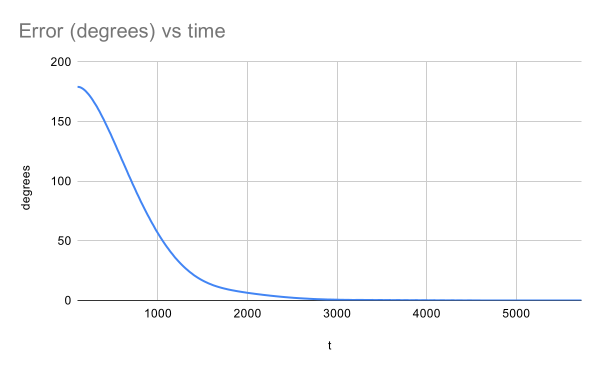
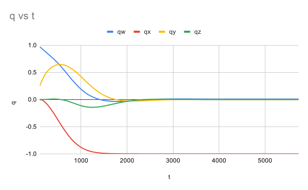

# Quaternion Attitude Control

Quaternion-based attitude determination and control for a rigid body in orbit,
running on an ATmega2560 against a physics plant simulated in a custom Wokwi
chip. The MCU never sees the true attitude — it estimates it from a noisy
accelerometer and gyroscope, and closes a PD loop on quaternion error.

The interesting constraint is that the AVR has **no floating-point unit**. Every
`sin`, `sqrt` and quaternion product is a software routine, and the control loop
still has to close at a usable rate.

---

## How it works

```
   ATmega2560  (sketch.ino)                     Custom chip  (chip/chip.chip.c)
  ┌────────────────────────────┐               ┌──────────────────────────────┐
  │ Mahony fusion  accel+gyro  │◄──── I²C ─────│ Euler's equations, RK4       │
  │        ↓                   │   0x42        │ Exponential-map quaternion   │
  │ q_est                      │   400 kHz     │ integration @ 1 kHz          │
  │        ↓                   │               │                              │
  │ PD law on quaternion error │──── τ ───────►│ Noisy accel + gyro out       │
  │        ↓                   │               │ q_true (scoring only)        │
  │ OLED horizon @ 30 Hz       │               └──────────────────────────────┘
  └────────────────────────────┘
     joystick → attitude command
     pot      → gain multiplier
```

The plant integrates angular velocity with RK4 and attitude with the exponential
map, which is norm-preserving by construction. The MCU runs a Mahony
complementary filter to fuse the accelerometer's gravity reference against gyro
integration, then applies

```
q_err = q_est⁻¹ ⊗ q_cmd
τ     = Kp · sign(q_err.w) · q_err.vec  −  Kd · ω
```

`sign(q_err.w)` is the unwinding fix. `q` and `−q` are the same rotation, so a
negative scalar part means the controller is about to rotate the long way around;
negating flips it to the short path. It is four characters and it is the whole
point of the naive-vs-optimized comparison below.

### Conventions

Most quaternion bugs are two individually-correct pieces of code disagreeing
about convention. This project pins them:

| Thing | Choice |
|---|---|
| Storage order | `q = [w, x, y, z]` — scalar first |
| Algebra | Hamilton, not JPL |
| Meaning of `q` | rotates a vector **from body frame into world frame** |
| `ω`, `τ` | body frame; rad/s and N·m |
| Wire format | little-endian `float32` |
| Angles on the wire | radians — degrees only for display |

Euler angles are computed for the OLED and **never fed back into control**.

---

## Results

Both runs start from the same tumble: `ω = [0.01, 5.0, 0.0]` rad/s with the
commanded attitude just under 180° away, which is precisely the case that
separates a controller that unwinds from one that does not.

| | Naive | With `sign(q_err.w)` |
|---|---|---|
| Initial error | 180.91° | 179.09° |
| Final error | 1.24° | 0.00° |
| Time to <5° | ~2148 ms | ~2153 ms |
| Mean loop time | 2000 µs (500 Hz) | 2041 µs (490 Hz) |

**Read that table carefully, because it does not say what it looks like it says.**

The two initial errors are the same physical attitude: 360 − 180.91 = 179.09. The
naive controller measures its error the long way around and commits to rotating
through it; the corrected one takes the short path. That difference is real and
it is visible in the trajectory plots.

What the data does **not** show is the corrected controller settling faster. Both
reach <5° within about 2.15 s, and the corrected one runs marginally slower per
loop. The honest summary is that on this run the unwinding fix improved the
*path* and the *final tracking error*, not the settling time.

That comparison is also weaker than it should be: the naive run ends at 2736 ms,
barely after its own settling point, while the corrected run continues to
5727 ms. The runs are not length-matched, so the naive settling figure rests on
almost its last sample. Regenerating both over a common window is outstanding
work, not a completed result.





### Gains

Treating each axis as `J·θ̈ = τ` and using the small-angle result `q_err.vec ≈ θ/2`,
the effective proportional gain is `Kp/2`:

```
ωn = sqrt(Kp / (2·J))          ζ = Kd / (2·sqrt(Kp·J/2))
```

With `J = [1, 2, 3]`, the shipped gains `Kp = [18, 36, 54]` and
`Kd = [4.2, 8.4, 12.6]` give **ωn = 3.0 rad/s and ζ = 0.7 on all three axes**.

The front-panel knob scales `Kp` and `Kd` together by `m ∈ [0.1, 3.0]`. Because
`ζ` depends on `Kd/sqrt(Kp)`, scaling both by `m` scales damping by `√m` — so the
knob sweeps ζ from 0.22 (ringing) to 1.21 (sluggish), passing through 0.7 at
m = 1. The knob is a damping control wearing a gain control's clothing.

---

## Known limitations

The simulation is honest about what it does not model. These are the places where
these results would not survive contact with hardware:

- **The gyro has no bias.** The plant adds zero-mean noise only. Rejecting slow
  gyro bias is the main reason a Mahony filter exists, and this sim never asks it
  to. The `0x60` control register that would inject bias is specified in the
  blueprint and not implemented.
- **The accelerometer measures gravity and nothing else.** No linear
  acceleration is modelled, so the classic failure mode — a manoeuvring vehicle
  whose accelerometer stops pointing at the ground — is never exercised. This is
  the single largest gap between this sim and a real vehicle.
- **Noise is uniform, not Gaussian, and `rand()` is never seeded.** Every run is
  bit-identical. Good for reproducibility, useless for characterising variance.
- **The MCU Euler-integrates `q` and renormalises.** The plant uses the
  exponential map; the MCU does not, which contradicts §2.4 of the blueprint. It
  is standard Mahony formulation, but the discrepancy is unmeasured.
- **`dt` is unclamped.** A stalled loop feeds an arbitrarily large step into the
  integrator.
- **Results predate the current plant.** The CSVs were recorded when the chip
  started at a 5 rad/s tumble; the current chip starts at rest. They are not
  reproducible from a clean checkout without restoring that initial condition.
- **Wokwi does not simulate ADC source impedance**, so the analog input circuit
  is validated only in principle.
- **No CI.** M9 is unstarted; nothing verifies the quaternion library on push.

---

## Running it

Open the project in [Wokwi](https://wokwi.com) — `diagram.json` and `sketch.ino`
must stay in the repository root, which is why the firmware is not tucked into a
subdirectory. The custom plant builds from `chip/chip.chip.c`.

Telemetry streams over serial at 115200 baud, 8 columns at 30 Hz:

```
q_est.w, q_est.x, q_est.y, q_est.z, q_true.w, q_true.x, q_true.y, q_true.z
```

Attitude error in degrees is `2·acos(|⟨q_est, q_true⟩|)`, computed downstream so
the metric can change without reflashing.

> **`q_true` is for scoring only.** It is read inside the telemetry block, after
> the torque command has gone out, into a local that leaves scope immediately —
> so the control path has no name bound to it. The estimator does not get to see
> the answer.

---

## Layout

```
sketch.ino        firmware: fusion, control law, OLED, telemetry
diagram.json      Wokwi wiring
libraries.txt     Wokwi library manifest
chip/             custom plant: rigid-body dynamics + simulated IMU
docs/blueprint.md the full design document — maths, register map, milestones
hardware/         KiCad schematic for the custom PCB (in progress)
results/          recorded runs and plots
```

`docs/blueprint.md` is the primary reference: it derives the maths, fixes the
conventions, specifies the I²C register map, and catalogues the traps this
project hit on the way through.
